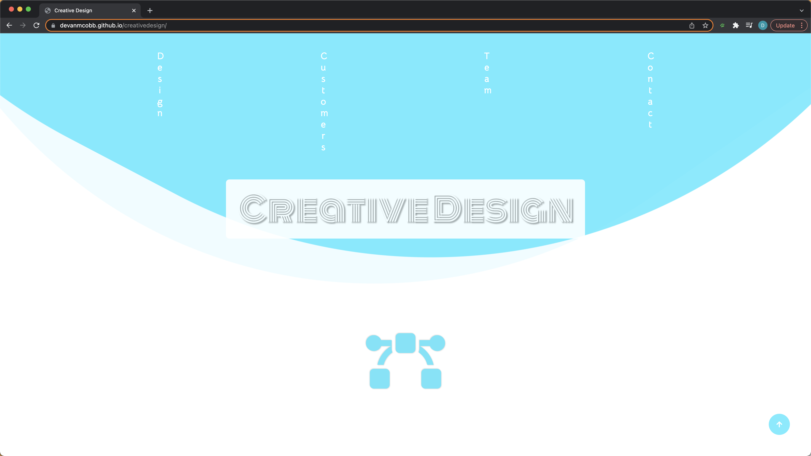
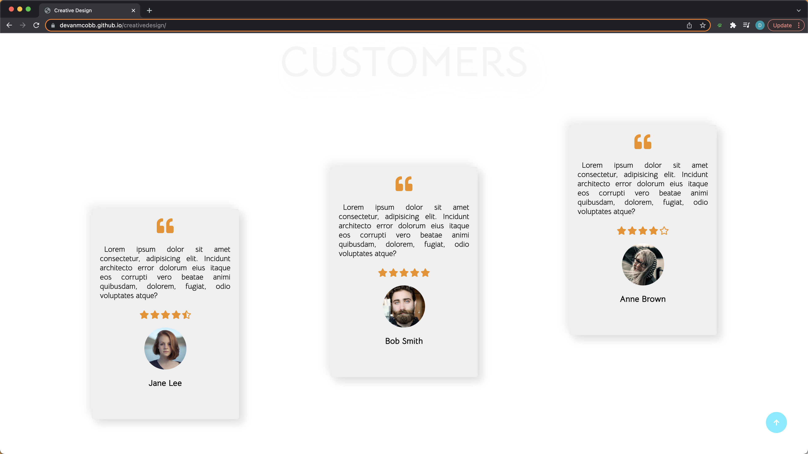
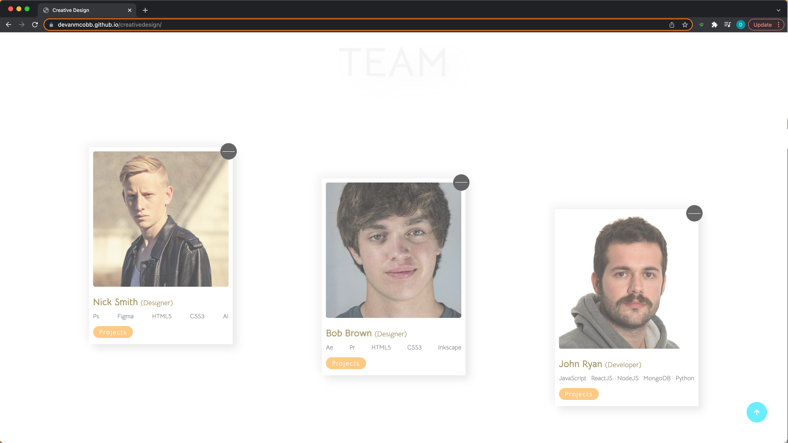
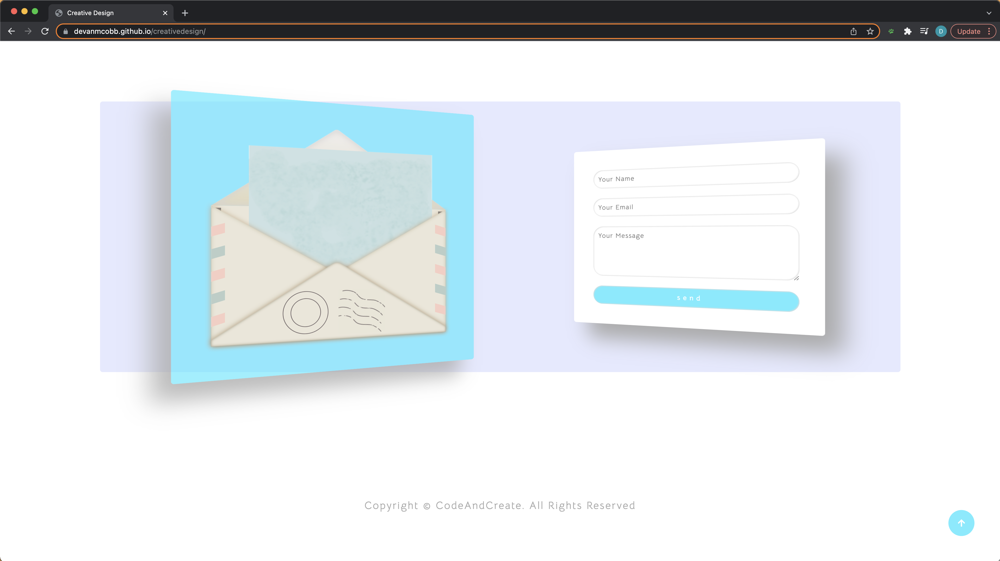

# A Creative Design

This project is a design definitely with new startup in mind. The landing page is the showstopper, with the awesome wave effect. Sleek custom testimonial and profile cards give this project a modern and minimal feel. Don't miss the 3D contact form at the bottom, the hover effect really brings both elements alive.

[Link to deployed Application](https://devanmcobb.github.io/creativedesign/)

## Tech Stack

**Client:** CSS, HTML, JavaScript

## Features

- Wave effect for the landing page
- Custom customer reviews
- Profile cards for all team and organization memebers
- 3D contact form

## Color Reference

| Color             | Hex                                                                |
| ----------------- | ------------------------------------------------------------------ |
| White         |  #fff|
| Turquoise Blue|  #32e7ff|
| Carrot Orange |  #f08e0f|
| Darkgray      |  #aaa |

## Screenshots

## Questions

For any further questions regarding this project or future collaboration, please contact me at:   [devancobb.dev@gmail.com](devancobb.dev@gmail.com)

## Acknowledgements

 - [Udemy 10 Mega Responsive Websites](https://udemy.com)
 - [#100Devs](https://leonnoel.com/100devs)
 - [freeCodeCamp](https://freecodecamp.com)

